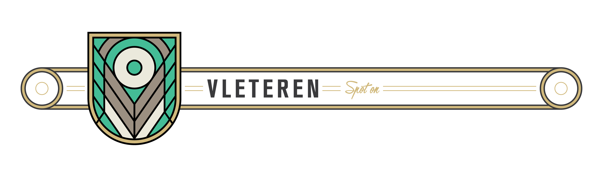

[](https://travis-ci.org/icapps/ios-vleteren)
[](http://cocoapods.org/pods/Vleteren)
[](http://cocoapods.org/pods/Vleteren)
[](http://cocoapods.org/pods/Vleteren)
[](https://swift.org)

> Vleteren contains a set of components that makes location handling more simple.

## TOC

- [Installation](#installation)
- [Features](#features)
- [Bucket List](#bucket-list)
- [Author](#author)
- [License](#license)

## Installation

Vleteren is available through [CocoaPods](http://cocoapods.org). To install it, simply add the following line to your `Podfile`:

```ruby
pod 'Vleteren', '~> 0.1'
```

## Features

## Bucket List

Here is an overview what is on our todo list.

- [ ] Know you current location throughout the app.
- [ ] Simple beacon handling.

## Author

Jelle Vandebeeck, jelle@fousa.be

## License

Vleteren is available under the MIT license. See the LICENSE file for more info.
